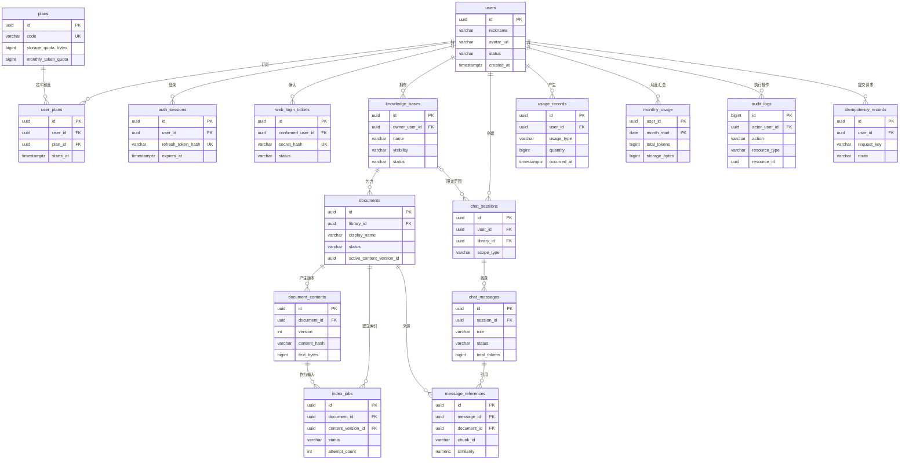

# 个人知识库全栈版本 · 数据表结构设计

## 1. 数据模型总览（ER 图）

## 2. 通用约定

- 业务实体主键使用 PostgreSQL `uuid`，由应用使用 UUID v7 生成；高写入量审计表使用 `bigserial`。
- 时间统一使用 `timestamptz` 并保存 UTC；月度周期使用 UTC 月首日 `date`。
- 可恢复的业务资源使用 `deleted_at` 软删除；不可变流水和审计表不提供软删除。
- 枚举先使用带 `CHECK` 约束的 `varchar`，避免 PostgreSQL enum 难以演进。
- 外键默认 `ON DELETE RESTRICT`；仅纯从属且无需审计保留的数据使用 `CASCADE`。
- 所有文本内容和 Token 不写入日志；数据库中的正文仅通过资源权限访问。

## 3. 表结构详细说明

### 3.1 用户表（users）

**业务说明**：保存应用用户资料。微信标识不直接保存在主表，避免常规用户查询接触身份映射。

| 字段名 | 类型 | 主键/索引 | 必填 | 默认值 | 说明 |
|--------|------|---------|------|--------|------|
| id | uuid | PK | 是 | 应用生成 | 用户 ID |
| nickname | varchar(80) | - | 是 | `微信用户` | 昵称 |
| avatar_url | varchar(1024) | - | 否 | NULL | 头像 URL |
| status | varchar(20) | IDX | 是 | `active` | `active/disabled` |
| last_login_at | timestamptz | - | 否 | NULL | 最近登录时间 |
| created_at | timestamptz | IDX | 是 | now() | 创建时间 |
| updated_at | timestamptz | - | 是 | now() | 更新时间 |
| deleted_at | timestamptz | IDX | 否 | NULL | 软删除时间 |

**索引设计**：`idx_users_status` 用于过滤可登录用户；`idx_users_deleted_at` 支持软删除过滤。

### 3.2 微信身份表（wechat_identities）

**业务说明**：保存微信身份与应用用户的映射，OpenID 采用应用级加密存储并额外保存不可逆查找哈希。

| 字段名 | 类型 | 主键/索引 | 必填 | 默认值 | 说明 |
|--------|------|---------|------|--------|------|
| id | uuid | PK | 是 | 应用生成 | 身份 ID |
| user_id | uuid | FK, IDX | 是 | - | 关联 `users.id` |
| app_id | varchar(64) | UK 组合 | 是 | - | 微信 AppID |
| openid_ciphertext | bytea | - | 是 | - | 加密后的 OpenID |
| openid_hash | char(64) | UK 组合 | 是 | - | HMAC-SHA256 查询值 |
| unionid_ciphertext | bytea | - | 否 | NULL | 加密后的 UnionID |
| unionid_hash | char(64) | IDX | 否 | NULL | UnionID 查询值 |
| created_at | timestamptz | - | 是 | now() | 创建时间 |
| updated_at | timestamptz | - | 是 | now() | 更新时间 |

**索引设计**：`uk_wechat_app_openid(app_id, openid_hash)` 保证身份唯一；`idx_wechat_user_id` 支持用户反查。

### 3.3 套餐表（plans）

**业务说明**：定义套餐展示名称和硬配额。

| 字段名 | 类型 | 主键/索引 | 必填 | 默认值 | 说明 |
|--------|------|---------|------|--------|------|
| id | uuid | PK | 是 | 应用生成 | 套餐 ID |
| code | varchar(40) | UK | 是 | - | 如 `personal_pro` |
| name | varchar(80) | - | 是 | - | 原型展示名称 |
| storage_quota_bytes | bigint | - | 是 | 5368709120 | 5 GiB |
| monthly_token_quota | bigint | - | 是 | 2000000 | 每月 Token 配额 |
| status | varchar(20) | IDX | 是 | `active` | `active/inactive` |
| created_at | timestamptz | - | 是 | now() | 创建时间 |
| updated_at | timestamptz | - | 是 | now() | 更新时间 |

### 3.4 用户套餐表（user_plans）

**业务说明**：记录用户套餐生效历史，同一时间只能有一个有效套餐。

| 字段名 | 类型 | 主键/索引 | 必填 | 默认值 | 说明 |
|--------|------|---------|------|--------|------|
| id | uuid | PK | 是 | 应用生成 | 记录 ID |
| user_id | uuid | FK, IDX | 是 | - | 用户 ID |
| plan_id | uuid | FK | 是 | - | 套餐 ID |
| starts_at | timestamptz | IDX | 是 | now() | 生效时间 |
| ends_at | timestamptz | IDX | 否 | NULL | 失效时间 |
| created_at | timestamptz | - | 是 | now() | 创建时间 |

**索引设计**：部分唯一索引 `uk_user_active_plan(user_id) WHERE ends_at IS NULL` 保证单一有效套餐。

### 3.5 认证会话表（auth_sessions）

**业务说明**：保存可撤销刷新会话，访问令牌本身不落库。

| 字段名 | 类型 | 主键/索引 | 必填 | 默认值 | 说明 |
|--------|------|---------|------|--------|------|
| id | uuid | PK | 是 | 应用生成 | 会话 ID |
| user_id | uuid | FK, IDX | 是 | - | 用户 ID |
| refresh_token_hash | char(64) | UK | 是 | - | 刷新令牌哈希 |
| client_type | varchar(20) | IDX | 是 | - | `miniprogram/web` |
| device_label | varchar(120) | - | 否 | NULL | 脱敏设备描述 |
| expires_at | timestamptz | IDX | 是 | - | 过期时间 |
| revoked_at | timestamptz | IDX | 否 | NULL | 撤销时间 |
| last_used_at | timestamptz | - | 否 | NULL | 最近刷新时间 |
| created_at | timestamptz | - | 是 | now() | 创建时间 |

### 3.6 Web 登录票据表（web_login_tickets）

**业务说明**：保存 Web 扫码登录的一次性短期票据状态。

| 字段名 | 类型 | 主键/索引 | 必填 | 默认值 | 说明 |
|--------|------|---------|------|--------|------|
| id | uuid | PK | 是 | 应用生成 | 票据 ID |
| secret_hash | char(64) | UK | 是 | - | 二维码随机秘密哈希 |
| status | varchar(20) | IDX | 是 | `pending` | `pending/confirmed/consumed/expired` |
| confirmed_user_id | uuid | FK, IDX | 否 | NULL | 确认用户 |
| expires_at | timestamptz | IDX | 是 | - | 5 分钟过期 |
| confirmed_at | timestamptz | - | 否 | NULL | 确认时间 |
| consumed_at | timestamptz | - | 否 | NULL | Web 消费时间 |
| created_at | timestamptz | - | 是 | now() | 创建时间 |

### 3.7 知识库表（knowledge_bases）

**业务说明**：保存多知识库信息及原型列表所需统计缓存。

| 字段名 | 类型 | 主键/索引 | 必填 | 默认值 | 说明 |
|--------|------|---------|------|--------|------|
| id | uuid | PK | 是 | 应用生成 | 知识库 ID |
| owner_user_id | uuid | FK, IDX | 是 | - | 所有者 |
| name | varchar(120) | IDX | 是 | - | 名称 |
| category | varchar(40) | IDX | 是 | `uncategorized` | 分类代码 |
| description | varchar(1000) | - | 是 | 空字符串 | 描述 |
| visibility | varchar(20) | IDX | 是 | `private` | `private/public` |
| status | varchar(20) | IDX | 是 | `active` | `active/deleting/delete_failed` |
| document_count | integer | - | 是 | 0 | 有效文件数缓存 |
| chunk_count | bigint | - | 是 | 0 | 有效片段数缓存 |
| storage_bytes | bigint | - | 是 | 0 | 当前占用缓存 |
| indexed_tokens | bigint | - | 是 | 0 | 当前有效内容 Token 缓存 |
| created_at | timestamptz | IDX | 是 | now() | 创建时间 |
| updated_at | timestamptz | - | 是 | now() | 更新时间 |
| deleted_at | timestamptz | IDX | 否 | NULL | 软删除时间 |

**索引设计**：`idx_libraries_owner_status(owner_user_id, status, updated_at DESC)` 支持我的知识库；`idx_libraries_public(visibility, status, updated_at DESC) WHERE deleted_at IS NULL` 支持公开库。

### 3.8 文档表（documents）

**业务说明**：保存原文件元数据、解析状态及当前有效内容版本。

| 字段名 | 类型 | 主键/索引 | 必填 | 默认值 | 说明 |
|--------|------|---------|------|--------|------|
| id | uuid | PK | 是 | 应用生成 | 文档 ID |
| library_id | uuid | FK, IDX | 是 | - | 所属知识库 |
| uploaded_by | uuid | FK | 是 | - | 上传用户 |
| original_name | varchar(255) | - | 是 | - | 上传文件名 |
| display_name | varchar(255) | IDX | 是 | - | 可修改展示名 |
| extension | varchar(16) | IDX | 是 | - | 规范化扩展名 |
| mime_type | varchar(120) | - | 是 | - | 检测到的 MIME |
| original_bytes | bigint | - | 是 | - | 原文件字节数 |
| original_sha256 | char(64) | IDX | 是 | - | 原文件哈希 |
| original_path | varchar(1024) | - | 是 | - | 数据目录内相对路径 |
| status | varchar(30) | IDX | 是 | `queued` | `queued/processing/ready/failed/deleting/delete_failed` |
| summary | varchar(1000) | - | 是 | 空字符串 | 内容摘要 |
| tags | jsonb | GIN | 是 | `[]` | 字符串标签数组 |
| active_content_version_id | uuid | IDX | 否 | NULL | 当前有效内容版本 |
| chunk_count | integer | - | 是 | 0 | 有效片段数 |
| indexed_tokens | bigint | - | 是 | 0 | 有效版本 Token |
| last_indexed_at | timestamptz | - | 否 | NULL | 最近索引完成时间 |
| created_at | timestamptz | IDX | 是 | now() | 创建时间 |
| updated_at | timestamptz | - | 是 | now() | 更新时间 |
| deleted_at | timestamptz | IDX | 否 | NULL | 软删除时间 |

**索引设计**：`idx_documents_library_status(library_id, status, updated_at DESC)`；`gin_documents_tags` 支持标签筛选；名称和摘要搜索使用 `pg_trgm` GIN 索引。

### 3.9 文档内容版本表（document_contents）

**业务说明**：保存解析或在线编辑后的不可变纯文本版本及结构映射。

| 字段名 | 类型 | 主键/索引 | 必填 | 默认值 | 说明 |
|--------|------|---------|------|--------|------|
| id | uuid | PK | 是 | 应用生成 | 内容版本 ID |
| document_id | uuid | FK, UK 组合 | 是 | - | 文档 ID |
| version | integer | UK 组合 | 是 | - | 从 1 递增 |
| source_type | varchar(20) | IDX | 是 | - | `parsed/edited` |
| content_path | varchar(1024) | - | 是 | - | UTF-8 文本相对路径 |
| content_hash | char(64) | IDX | 是 | - | 文本 SHA-256 |
| text_bytes | bigint | - | 是 | - | 文本字节数 |
| token_estimate | bigint | - | 是 | 0 | 索引前估算 Token |
| structure_map | jsonb | GIN | 是 | `{}` | 页码/章节映射 |
| created_by | uuid | FK | 是 | - | 创建用户或系统用户 |
| created_at | timestamptz | IDX | 是 | now() | 创建时间 |

**索引设计**：`uk_document_content_version(document_id, version)`；`idx_content_document_created(document_id, created_at DESC)`。

### 3.10 索引任务表（index_jobs）

**业务说明**：保存上传、重新索引和删除清理任务，支持租约、恢复和重试。

| 字段名 | 类型 | 主键/索引 | 必填 | 默认值 | 说明 |
|--------|------|---------|------|--------|------|
| id | uuid | PK | 是 | 应用生成 | 任务 ID |
| document_id | uuid | FK, IDX | 是 | - | 文档 ID |
| content_version_id | uuid | FK, IDX | 否 | NULL | 索引输入版本；删除任务为空 |
| job_type | varchar(20) | IDX | 是 | - | `index/reindex/delete` |
| status | varchar(20) | IDX | 是 | `queued` | `queued/running/ready/failed/cancelled` |
| progress | smallint | - | 是 | 0 | 0–100 |
| stage | varchar(40) | - | 是 | `queued` | 当前阶段 |
| attempt_count | smallint | - | 是 | 0 | 已尝试次数 |
| max_attempts | smallint | - | 是 | 3 | 最大自动尝试次数 |
| next_run_at | timestamptz | IDX | 是 | now() | 下次可领取时间 |
| lease_expires_at | timestamptz | IDX | 否 | NULL | Worker 租约到期 |
| worker_id | varchar(80) | - | 否 | NULL | Worker 标识 |
| error_code | varchar(80) | IDX | 否 | NULL | 稳定错误码 |
| error_message | varchar(1000) | - | 否 | NULL | 脱敏错误信息 |
| started_at | timestamptz | - | 否 | NULL | 开始时间 |
| finished_at | timestamptz | - | 否 | NULL | 完成时间 |
| created_at | timestamptz | IDX | 是 | now() | 创建时间 |
| updated_at | timestamptz | - | 是 | now() | 更新时间 |

**索引设计**：`idx_jobs_claim(status, next_run_at, created_at)` 支持任务领取；部分唯一索引限制每个文档最多一个 `queued/running` 活跃任务。

### 3.11 问答会话表（chat_sessions）

**业务说明**：保存原型历史记录和检索范围。

| 字段名 | 类型 | 主键/索引 | 必填 | 默认值 | 说明 |
|--------|------|---------|------|--------|------|
| id | uuid | PK | 是 | 应用生成 | 会话 ID |
| user_id | uuid | FK, IDX | 是 | - | 会话所有者 |
| scope_type | varchar(20) | IDX | 是 | - | `single_library/global` |
| library_id | uuid | FK, IDX | 否 | NULL | 单库模式目标库 |
| title | varchar(160) | - | 是 | `新建问答` | 会话标题 |
| created_at | timestamptz | IDX | 是 | now() | 创建时间 |
| updated_at | timestamptz | IDX | 是 | now() | 更新时间 |
| deleted_at | timestamptz | IDX | 否 | NULL | 软删除时间 |

**约束**：`single_library` 必须有 `library_id`；`global` 必须为空。

### 3.12 问答消息表（chat_messages）

**业务说明**：保存用户问题、模型回答、生成状态和 Token 统计。

| 字段名 | 类型 | 主键/索引 | 必填 | 默认值 | 说明 |
|--------|------|---------|------|--------|------|
| id | uuid | PK | 是 | 应用生成 | 消息 ID |
| session_id | uuid | FK, IDX | 是 | - | 会话 ID |
| role | varchar(20) | IDX | 是 | - | `user/assistant` |
| content | text | - | 是 | - | 消息正文 |
| status | varchar(20) | IDX | 是 | `complete` | `streaming/complete/interrupted/failed` |
| model | varchar(120) | - | 否 | NULL | 回答模型 |
| input_tokens | bigint | - | 是 | 0 | 输入 Token |
| output_tokens | bigint | - | 是 | 0 | 输出 Token |
| total_tokens | bigint | - | 是 | 0 | 合计 Token |
| request_id | varchar(80) | IDX | 否 | NULL | 请求追踪 ID |
| created_at | timestamptz | IDX | 是 | now() | 创建时间 |
| updated_at | timestamptz | - | 是 | now() | 更新时间 |

**索引设计**：`idx_messages_session_created(session_id, created_at, id)` 支持稳定时间序列查询。

### 3.13 消息引用表（message_references）

**业务说明**：保存回答生成时使用的来源依据，不依赖文档后续改名或重新索引。

| 字段名 | 类型 | 主键/索引 | 必填 | 默认值 | 说明 |
|--------|------|---------|------|--------|------|
| id | uuid | PK | 是 | 应用生成 | 引用 ID |
| message_id | uuid | FK, IDX | 是 | - | Assistant 消息 ID |
| document_id | uuid | FK, IDX | 是 | - | 来源文档 |
| content_version_id | uuid | FK | 是 | - | 来源内容版本 |
| chunk_id | varchar(160) | IDX | 是 | - | 向量片段 ID |
| source_name_snapshot | varchar(255) | - | 是 | - | 当时展示名称快照 |
| location_label | varchar(255) | - | 是 | 空字符串 | 页码或章节 |
| excerpt | text | - | 是 | - | 引用片段快照 |
| similarity | numeric(6,5) | - | 是 | - | 0–1 相似度 |
| rank | smallint | - | 是 | - | 引用排序 |
| created_at | timestamptz | - | 是 | now() | 创建时间 |

### 3.14 用量流水表（usage_records）

**业务说明**：保存不可变资源用量流水，是统计校准的事实依据。

| 字段名 | 类型 | 主键/索引 | 必填 | 默认值 | 说明 |
|--------|------|---------|------|--------|------|
| id | uuid | PK | 是 | 应用生成 | 流水 ID |
| user_id | uuid | FK, IDX | 是 | - | 被计费用户 |
| usage_type | varchar(30) | IDX | 是 | - | `storage/embedding/input/output` |
| quantity | bigint | - | 是 | - | 正数增加、负数释放 |
| unit | varchar(20) | - | 是 | - | `bytes/tokens` |
| resource_type | varchar(40) | IDX | 是 | - | `document/content/message` |
| resource_id | uuid | IDX | 是 | - | 资源 ID |
| occurred_at | timestamptz | IDX | 是 | now() | 发生时间 |
| metadata | jsonb | GIN | 是 | `{}` | 不含正文的模型、版本等信息 |
| created_at | timestamptz | - | 是 | now() | 入库时间 |

**索引设计**：`idx_usage_user_month(user_id, occurred_at)`；`idx_usage_resource(resource_type, resource_id)` 支持幂等核对。

### 3.15 月度用量表（monthly_usage）

**业务说明**：保存容量与当月 Token 聚合，用于原型展示和事务配额校验。

| 字段名 | 类型 | 主键/索引 | 必填 | 默认值 | 说明 |
|--------|------|---------|------|--------|------|
| user_id | uuid | PK, FK | 是 | - | 用户 ID |
| month_start | date | PK | 是 | - | UTC 月首日 |
| storage_bytes | bigint | - | 是 | 0 | 当前容量快照 |
| embedding_tokens | bigint | - | 是 | 0 | 当月向量化 Token |
| input_tokens | bigint | - | 是 | 0 | 当月问答输入 Token |
| output_tokens | bigint | - | 是 | 0 | 当月问答输出 Token |
| total_tokens | bigint | - | 是 | 0 | 三类 Token 合计 |
| updated_at | timestamptz | - | 是 | now() | 更新时间 |

**约束**：所有计数字段不得小于 0；主键为 `(user_id, month_start)`。

### 3.16 审计日志表（audit_logs）

**业务说明**：保存关键业务动作，供用户追踪登录、知识库和文件操作。

| 字段名 | 类型 | 主键/索引 | 必填 | 默认值 | 说明 |
|--------|------|---------|------|--------|------|
| id | bigserial | PK | 是 | 自增 | 审计 ID |
| actor_user_id | uuid | FK, IDX | 否 | NULL | 系统动作时为空 |
| action | varchar(80) | IDX | 是 | - | 如 `document.reindex` |
| resource_type | varchar(40) | IDX | 是 | - | 资源类型 |
| resource_id | uuid | IDX | 否 | NULL | 资源 ID |
| result | varchar(20) | IDX | 是 | - | `success/failure` |
| request_id | varchar(80) | IDX | 否 | NULL | 请求追踪 ID |
| client_type | varchar(20) | - | 否 | NULL | `web/miniprogram/worker` |
| ip_hash | char(64) | - | 否 | NULL | 加盐哈希，不保存原 IP |
| metadata | jsonb | GIN | 是 | `{}` | 白名单字段，不含正文与令牌 |
| occurred_at | timestamptz | IDX | 是 | now() | 发生时间 |

**索引设计**：`idx_audit_actor_time(actor_user_id, occurred_at DESC)`；按月删除超过 180 天记录。

### 3.17 幂等记录表（idempotency_records）

**业务说明**：防止上传、编辑、重新索引和扫码确认因重试产生重复副作用。

| 字段名 | 类型 | 主键/索引 | 必填 | 默认值 | 说明 |
|--------|------|---------|------|--------|------|
| id | uuid | PK | 是 | 应用生成 | 记录 ID |
| user_id | uuid | FK, UK 组合 | 是 | - | 请求用户 |
| route | varchar(160) | UK 组合 | 是 | - | 规范化路由 |
| request_key | varchar(120) | UK 组合 | 是 | - | 客户端幂等键 |
| request_hash | char(64) | - | 是 | - | 请求语义哈希 |
| response_status | integer | - | 是 | - | HTTP 状态码 |
| response_body | jsonb | - | 是 | `{}` | 可重放的非敏感响应 |
| resource_id | uuid | IDX | 否 | NULL | 创建的资源 ID |
| expires_at | timestamptz | IDX | 是 | - | 默认 24 小时过期 |
| created_at | timestamptz | - | 是 | now() | 创建时间 |

**索引设计**：`uk_idempotency_user_route_key(user_id, route, request_key)` 保证请求唯一。

## 4. 关键约束与触发规则

- `documents.active_content_version_id` 必须指向同一文档的内容版本，由 service 事务校验。
- `knowledge_bases` 处于 `deleting` 时禁止创建文档、编辑或问答。
- `documents` 每次状态变化均由状态机校验，不允许从 `ready` 直接回到 `queued` 而不创建任务。
- 公开库的可见性只影响读取授权，不改变用量归属；问答 Token 计入提问用户，索引 Token 与存储计入所有者。
- 删除文档时写入负的存储用量流水；历史问答引用保留名称和片段快照。
- 审计表和用量表只追加，不允许业务 API 更新或删除未过期记录。

## 5. 分区与数据增长策略

- 首版 100 用户规模无需业务分表。
- `audit_logs` 与 `usage_records` 预留按 `occurred_at` 月度范围分区的 migration，但首版可使用普通表降低运维复杂度。
- `chat_messages` 达到百万级后再按 `created_at` 分区；当前使用联合索引即可。
- Milvus 单 collection 保存多用户向量，通过标量字段过滤；Mem 存储采用同一元数据模型。

## 6. 软删除与清理策略

- 用户、知识库、文档和会话使用 `deleted_at`；查询默认附带 `deleted_at IS NULL`。
- 文件删除先设置 `status=deleting`，Worker 成功清理文件和向量后写 `deleted_at`。
- 内容版本在文档存在期间保留；可配置仅保留最近 10 个非活跃版本，清理前先检查引用关系。
- 登录票据、幂等记录和过期会话由每日清理任务物理删除。

## 7. 归档与保留策略

- 应用 JSON 日志保留 30 天并滚动压缩。
- 审计日志在线保留 180 天，过期后物理删除。
- 用量流水至少保留 24 个月，月度汇总长期保留。
- 聊天历史由用户主动删除；删除后保留 30 天软删除窗口，再清理正文，审计记录继续保留。
- 原始文件在文档彻底删除任务成功后删除；任务失败时保留并告警，避免形成数据库已删但文件残留的不可见数据。

## 8. Migration 与旧数据导入

- 所有 schema 变更使用按版本排序的 SQL 文件，并记录在 `schema_migrations`。
- 普通网关启动只检查 schema 版本，不自动执行破坏性 migration。
- `cmd/migrate` 支持 `up/status`，部署时显式运行。
- 旧 `knowledge.json` 迁移需要指定目标用户，自动创建“默认知识库”。
- 迁移使用来源名和内容哈希建立幂等键；执行前备份旧文件，执行后输出文档数、片段数和失败项报告。
