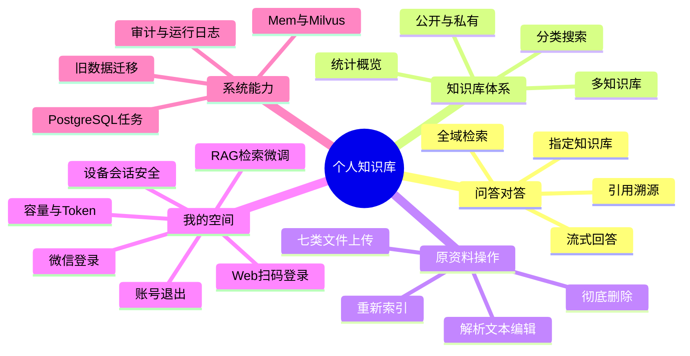
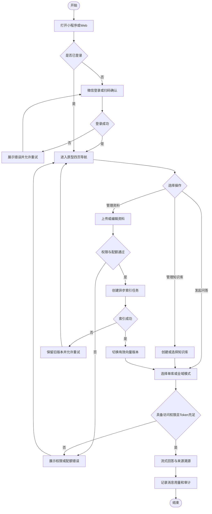
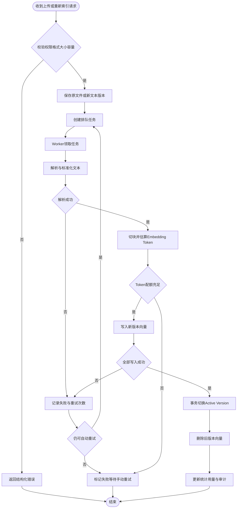
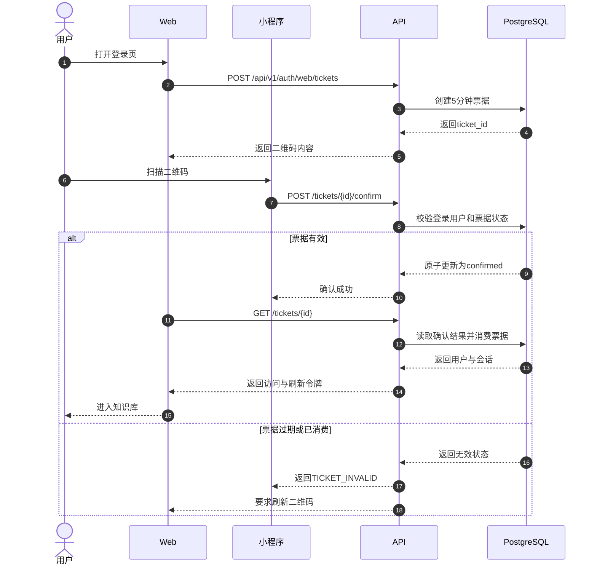
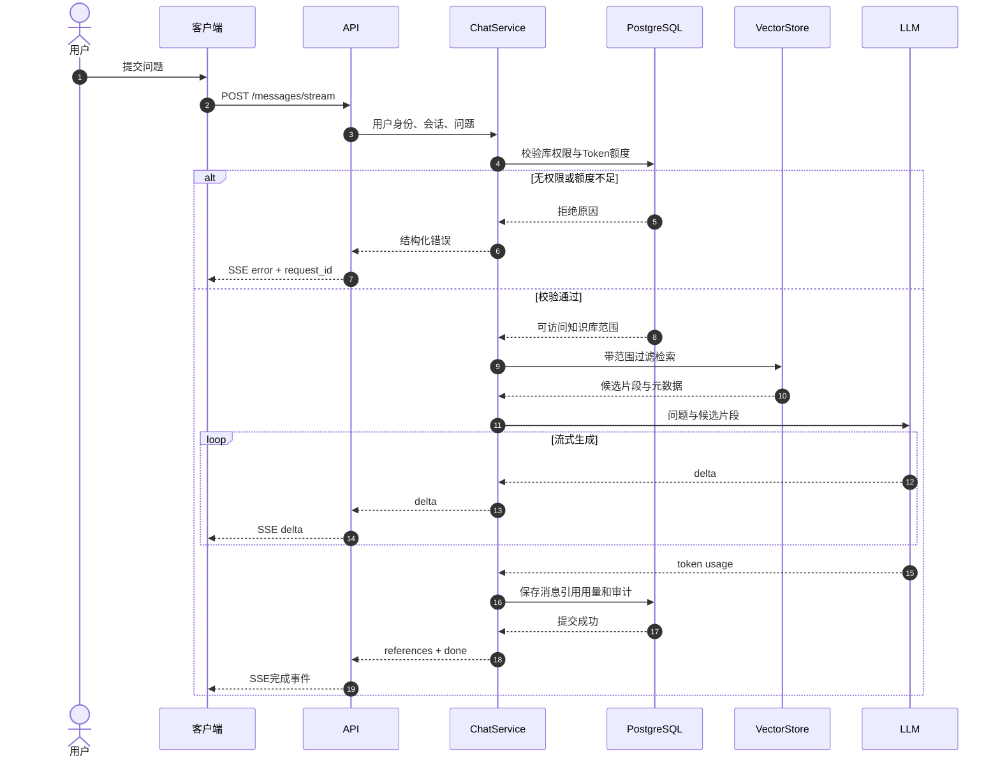
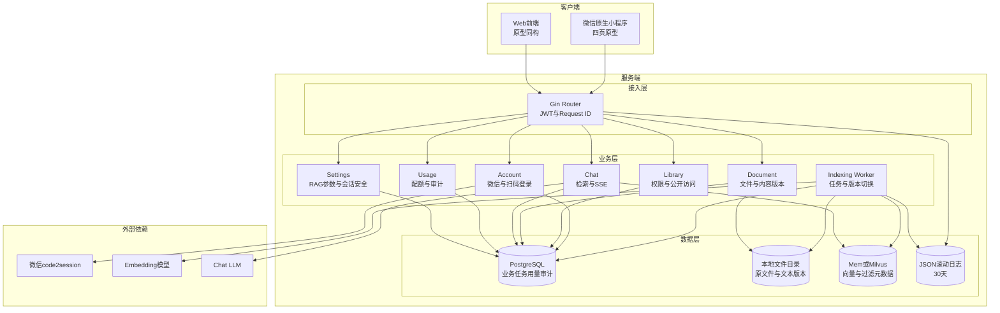
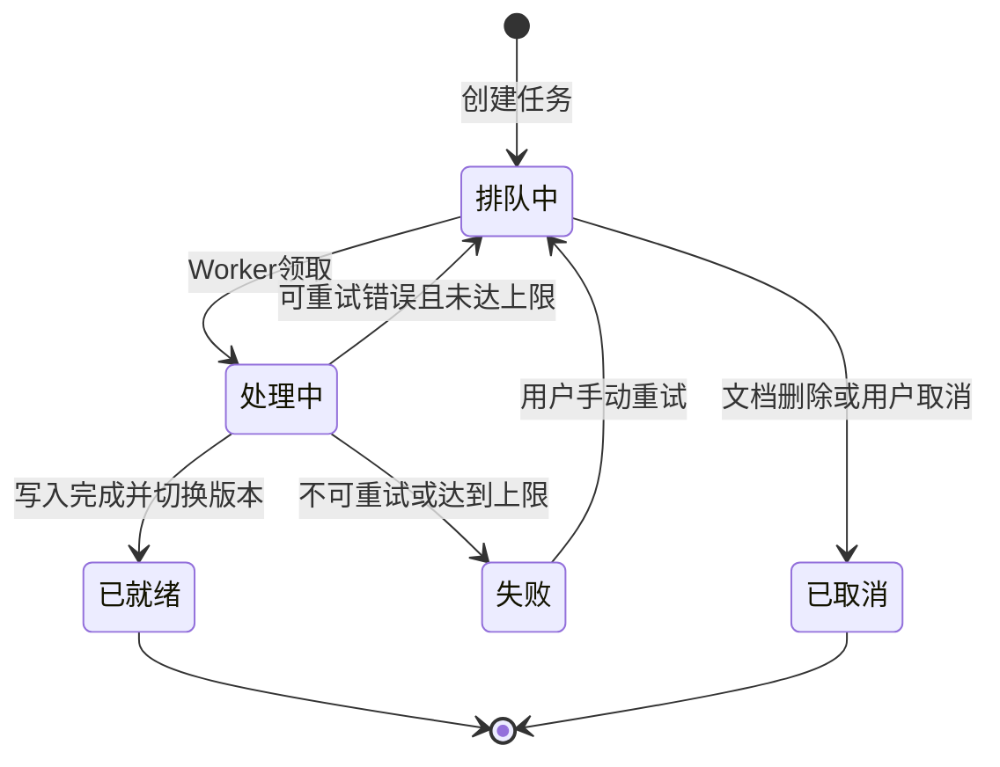
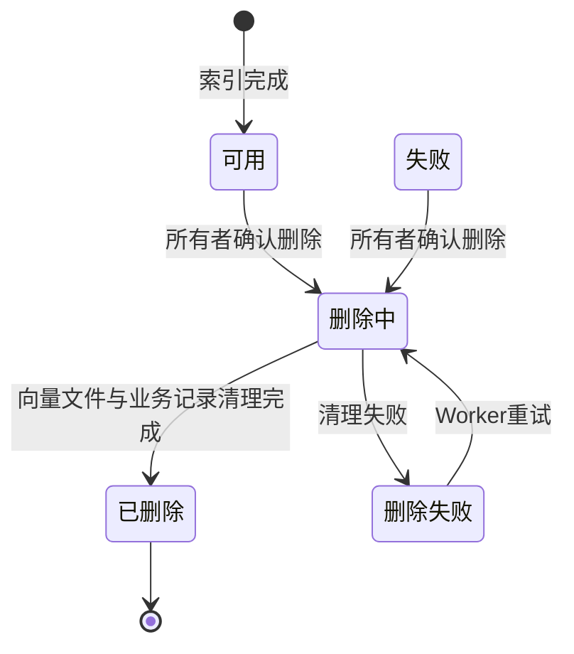

# 个人知识库全栈版本 · 图表文档

## 1. 系统思维导图（功能全貌）

图1：个人知识库功能全貌思维导图。四个原型页面由账号、权限、索引、配额和日志能力共同支撑。

## 2. 核心业务流程图

图2：用户从登录到可溯源问答的主流程。上传和索引解耦，索引失败不影响旧版本问答。

## 3. 文件上传与索引流程图

图3：文件版本化索引流程。只有新版本完整写入后，系统才替换当前检索版本。

## 4. 核心时序图

图4：Web 扫码登录时序图。登录票据短期有效且只能由已登录小程序确认一次。

图5：流式问答与用量记录时序图。服务端先确定权限范围，再调用向量库和模型。

## 5. 技术架构图

图6：系统技术架构图。首版以单进程模块化单体满足单实例部署，同时为未来拆分 Worker 保留端口。

## 6. 索引任务状态图

图7：索引任务状态机。失败任务最多自动重试三次，成功切换版本后进入终态。

## 7. 文档删除状态图

图8：文档删除状态机。删除采用先标记后清理，避免数据库、文件和向量出现半删除状态。

